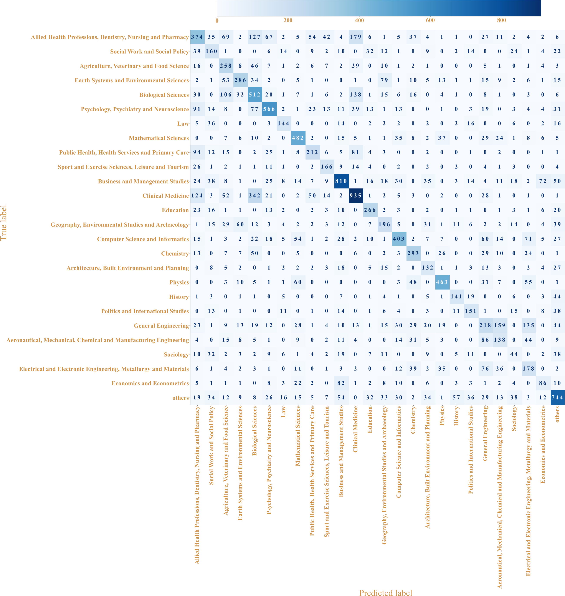

sdp2022
==============================

DoSSIER @ SDP2022


## Installation

```bash
$ conda create --name sdp2022 python==3.9.12
$ pip install -r requirements.txt
```

Install the `sdp2022` package:

```bash
$ pip install -e .
```

Add your CORE API key into `data/api_key.txt` file


Install spacy language model:

```nashorn js
$ python -m spacy download en_core_web_sm
```


Project Organization
------------

    ├── LICENSE
    ├── README.md                               <- The top-level README for developers using this project.
    │
    ├── config                                  <- The YML configuration files containing training and prediction params.
    │
    ├── data
    │   ├── processed                           <- The final, canonical data sets for modeling.
    │   ├── raw                                 <- The original, immutable data dump.
    │   └── external                            <- Additional data resources
    │
    ├── docs                                    <- A default Sphinx project; see sphinx-doc.org for details
    │
    ├── models                                  <- Trained and serialized models, model predictions, or model summaries
    │
    ├── notebooks                               <- Jupyter notebooks. Naming convention is a number (for ordering),
    │                                              the creator's initials, and a short `-` delimited description, e.g.
    │                                              `1.0-jqp-initial-data-exploration`.
    │
    ├── references                              <- Data dictionaries, manuals, and all other explanatory materials.
    │
    ├── reports                                 <- Generated analysis as HTML, PDF, LaTeX, etc.
    │
    ├── requirements.txt                        <- The requirements file for reproducing the analysis environment, e.g.
    │                                              generated with `pip freeze > requirements.txt`
    │
    └── sdp2022                                 <- Source code for use in this project.
        │
        ├── data                                <- Scripts to download or generate data
        │
        ├── utils                               <- Scripts utilities used during data generation or training
        │
        ├── training                            <- Scripts to train models
        │
        ├── validate                            <- Scripts to validate models
        │
        └── visualization                       <- Scripts to create exploratory and results oriented visualizations

